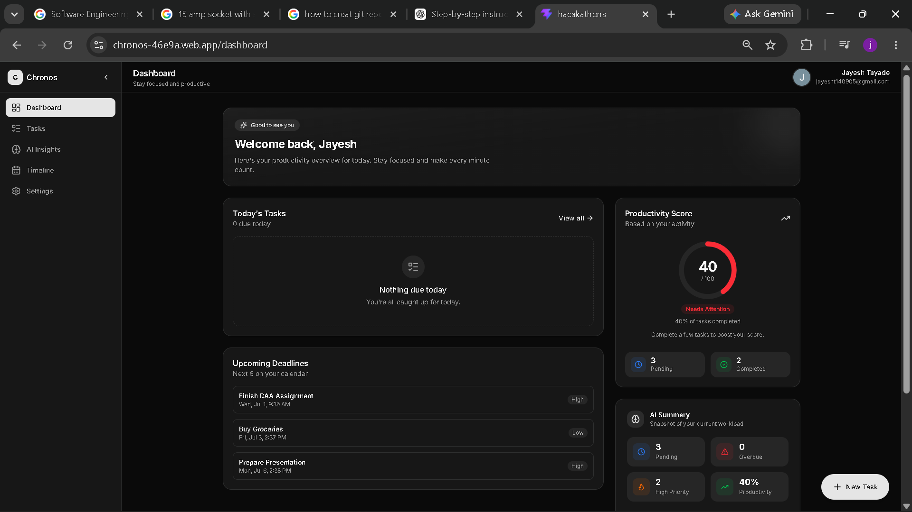
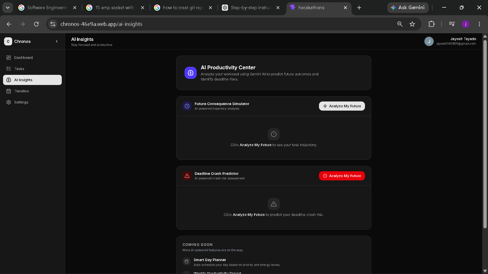
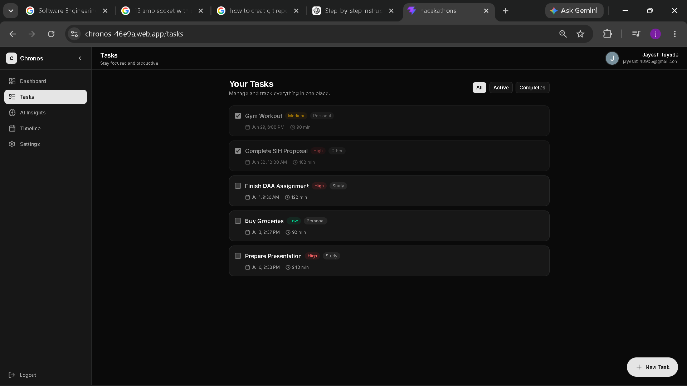
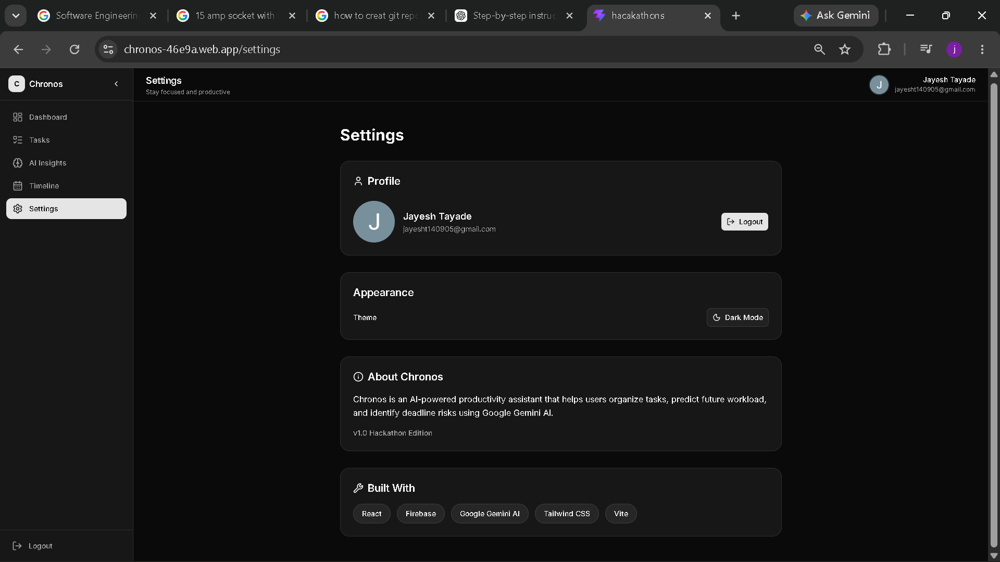
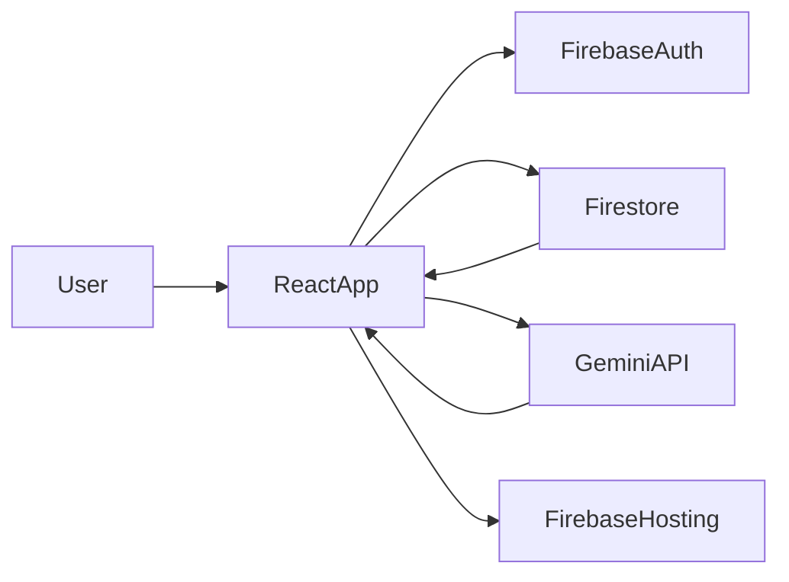

<div align="center">

# 🚀 Chronos

### AI-Powered Productivity Companion

Transform the way you manage tasks with **Google Gemini AI**.  
Chronos doesn't just remind you—it analyzes your workload, predicts risks, and helps you complete tasks before deadlines become a problem.

<br>

[](https://chronos-46e9a.web.app/)
[](https://github.com/jayesh-tayade/hackathon)

<br>


</div>

---

# 📖 About

**Chronos** is an AI-powered productivity companion built for the **"The Last-Minute Life Saver"** challenge.

Instead of acting as another reminder app, Chronos analyzes your tasks using **Google Gemini AI**, identifies workload risks, predicts deadline collisions, and provides personalized recommendations to help you stay ahead.

---

# 🎯 Problem Statement

Students, professionals, and entrepreneurs often miss deadlines because existing productivity apps rely on passive reminders that are easy to ignore.

Chronos solves this by using AI to proactively guide users before important deadlines are missed.

---

# ✨ Features

## 📋 Task Management

- ✅ Google Authentication
- ✅ Create Tasks
- ✅ Edit Tasks
- ✅ Delete Tasks
- ✅ Mark Tasks Complete
- ✅ Cloud Firestore Sync

---

## 🤖 AI Features

### Future Consequence Simulator

Analyze the impact of delaying important tasks.

- Risk Level
- Summary
- Future Consequences
- Recommendations
- Confidence Score

### Deadline Crash Predictor

Detect workload overload before it happens.

- Crash Risk
- Critical Tasks
- Recommendations
- Confidence Score

### AI Dashboard

- Productivity Score
- AI Summary
- Pending Tasks
- Upcoming Deadlines
- Personalized Recommendations

---

## 📅 Timeline View

Tasks are automatically grouped into:

- 🔴 Overdue
- 🟣 Today
- 🔵 Tomorrow
- 🟢 This Week
- ⚪ Later
- ✅ Completed

---

## 🎨 UI Features

- 🌙 Dark Mode
- 📱 Responsive Design
- ⚡ Fast & Modern Interface
- 🎯 Built with shadcn/ui

---

# 🖼️ Screenshots

> Replace these placeholders with your screenshots.

| Dashboard | AI Insights |
|-----------|-------------|
|  |  |

| Tasks | Timeline |
|-------|----------|
|  |  |

| Settings |
|----------|
|  |

---

# 🏗️ System Architecture



---

# 🛠️ Tech Stack

| Category | Technology |
|-----------|------------|
| Frontend | React + Vite |
| Styling | Tailwind CSS + shadcn/ui |
| Icons | Lucide React |
| Authentication | Firebase Authentication |
| Database | Cloud Firestore |
| AI | Google Gemini API |
| Hosting | Firebase Hosting |
| Version Control | Git & GitHub |

---

# ☁️ Google Technologies Used

- 🤖 Google Gemini API
- 🔐 Firebase Authentication
- 📂 Cloud Firestore
- 🌐 Firebase Hosting
- 🧠 Google AI Studio

---

# 📂 Project Structure

```text
src/
│
├── assets/
├── components/
│   ├── ai/
│   ├── common/
│   ├── dashboard/
│   ├── layout/
│   ├── tasks/
│   ├── timeline/
│   ├── theme/
│   └── ui/
│
├── constants/
├── context/
├── hooks/
├── pages/
├── prompts/
├── routes/
├── services/
├── styles/
├── utils/
│
├── App.jsx
└── main.jsx
```

---

# ⚙️ Installation

Clone the repository

```bash
git clone https://github.com/jayesh-tayade/hackathon.git
```

Move into the project

```bash
cd hackathon
```

Install dependencies

```bash
npm install
```

Create a `.env` file

```env
VITE_FIREBASE_API_KEY=
VITE_FIREBASE_AUTH_DOMAIN=
VITE_FIREBASE_PROJECT_ID=
VITE_FIREBASE_STORAGE_BUCKET=
VITE_FIREBASE_MESSAGING_SENDER_ID=
VITE_FIREBASE_APP_ID=
VITE_GEMINI_API_KEY=
VITE_GEMINI_MODEL=
```

Run the project

```bash
npm run dev
```

Build for production

```bash
npm run build
```

---

# 🚀 Live Demo

🌐 **https://chronos-46e9a.web.app/**

---

# 🔮 Future Scope

- 📅 Google Calendar Integration
- 🤖 Smart Daily Planner
- 📊 Weekly Productivity Reports
- 🎙️ Voice Assistant
- 🔔 Smart Notifications
- 📈 Habit Tracking
- 👥 Team Collaboration

---

# 👨‍💻 Developer

**Jayesh Chandrankant Tayade**

D. Y. Patil College of Engineering, Akurdi

---
    
---

<div align="center">

### ⭐ If you like this project, consider giving it a star!

Built with ❤️ using **React**, **Firebase**, and **Google Gemini AI**

</div>